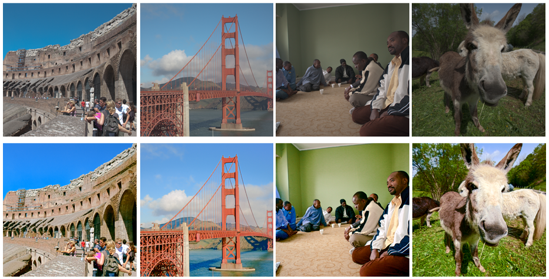

## Towards Unsupervised Deep Image Enhancement with Generative Adversarial Network

#### IEEE Transactions on Image Processing (T-IP)
[Zhangkai Ni](https://eezkni.github.io/)<sup>1</sup>, [Wenhan Yang](https://flyywh.github.io/)<sup>1</sup>, [Shiqi Wang](https://www.cs.cityu.edu.hk/~shiqwang/)<sup>1</sup>, [Lin Ma](http://forestlinma.com/)<sup>2</sup>, [Sam Kwong](http://www6.cityu.edu.hk/stfprofile/cssamk.htm)<sup>1</sup>

##### [[Paper-arXiv](https://arxiv.org/abs/2012.15020)] [[Paper-official](https://ieeexplore.ieee.org/document/9204448)] 

<sup>1</sup>City University of Hong Kong, <sup>2</sup>Meituan Group

## Introdcurion

This website shares the codes of the "Towards Unsupervised Deep Image Enhancement with Generative Adversarial Network", IEEE Transactions on Image Processing (T-IP), vol. 29, pp. 9140-9151, September 2020. 




### Abstract

Improving the aesthetic quality of images is challenging and eager for the public. To address this problem, most existing algorithms are based on supervised learning methods to learn an automatic photo enhancer for paired data, which consists of low-quality photos and corresponding expert-retouched versions. However, the style and characteristics of photos retouched by experts may not meet the needs or preferences of general users. In this paper, we present an unsupervised image enhancement generative adversarial network (UEGAN), which learns the corresponding image-to-image mapping from a set of images with desired characteristics in an unsupervised manner, rather than learning on a large number of paired images. The proposed model is based on single deep GAN which embeds the modulation and attention mechanisms to capture richer global and local features. Based on the proposed model, we introduce two losses to deal with the unsupervised image enhancement: (1) fidelity loss, which is defined as a ℓ2 regularization in the feature domain of a pre-trained VGG network to ensure the content between the enhanced image and the input image is the same, and (2) quality loss that is formulated as a relativistic hinge adversarial loss to endow the input image the desired characteristics. Both quantitative and qualitative results show that the proposed model effectively improves the aesthetic quality of images.

<!-- **The framework of UEGAN:** -->


## Requirements and Installation
We recommended the following dependencies.
*  Python 3.6
*  PyTorch 1.4.0
*  tqdm 4.43.0
*  munch 2.5.0
*  torchvision 0.5.0


<!-- ## Installation -->
```
git clone https://github.com/eezkni/UEGAN --recursive
cd UEGAN
```

## Preparing Data for the MIT-Adobe FiveK Dataset
You can follow the instructions below to generate your own training images. Or, you can directly download our exported images [FiveK_dataset_nzk](https://drive.google.com/drive/folders/1Jv0_9CnYxh_2ReFaVrwG19O3F7xBtdZT?usp=sharing). (~6GB)

### Getting the MIT-Adobe FiveK Dataset
 - Download the dataset from https://data.csail.mit.edu/graphics/fivek/. (~50GB, SHA1)
 - Extract the data.
 - Open `fivek.lrcat` with Lightroom. Just click "upgrade" if Lightroom asks you to upgrade.

### Generating the Low-quality Images
 - Import the FiveK dataset into Adobe Lightroom.
 - In the `Collections` list (bottom left), select collection **`Inputs/InputAsShotZeroed`**.
 - Export all images in the following settings:
   - Select all images at the bottom or in the middle (select one and press `Ctrl-A`), right-click any of them and select `Export/Export...`. 
   - Export Location: `Export to`=`Specific folder`, `Folder`=`Your folder for low-quality images`.
   - File Settings: `Image Format`=`PNG`, `Color Space`=`sRGB`, `Bit Depth`=`8 bit/component`
   - Image Sizing: `Resize to Fit`=`Short Edge`, select `Don't Enlarge`, Fill in `512 pixels`, `Resolution` doesn't matter to ignort it.
   - Finally, click `Export`.

### Generating the High-quality Images
 - Import the FiveK dataset into Adobe Lightroom.
 - In the `Collections` list (bottom left), select collection **`Experts/C`**.
 - Export all images in the following settings:
   - Select all images at the bottom or in the middle (select one and press `Ctrl-A`), right-click any of them and select `Export/Export...`. 
   - Export Location: `Export to`=`Specific folder`, `Folder`=`Your folder for high-quality images`.
   - File Settings: `Image Format`=`PNG`, `Color Space`=`sRGB`, `Bit Depth`=`8 bit/component`
   - Image Sizing: `Resize to Fit`=`Short Edge`, select `Don't Enlarge`, Fill in `512 pixels`, `Resolution` doesn't matter to ignort it.
   - Finally, click `Export`.


## Training
Prepare the training, testing, and validation data. The folder structure should be:
```
data
└─── fiveK
	├─── train
	|	├─── exp
	|	|	├──── a1.png                  
	|	|	└──── ......
	|	└─── raw
	|		├──── b1.png                  
	|		└──── ......
	├─── val
	|	├─── label
	|	|	├──── c1.png                  
	|	|	└──── ......
	|	└─── raw
	|		├──── c1.png                  
	|		└──── ......
	└─── test
		├─── label
		| 	├──── d1.png                  
		| 	└──── ......
		└─── raw
			├──── d1.png                  
			└──── ......
```
```raw/```contains low-quality images, ```exp/``` contains unpaired high-quality images, and ```label/``` contains corresponding ground truth.

To train UEGAN on FiveK, run the training script below.
```
python main.py --mode train --version UEGAN-FiveK --use_tensorboard True \
--is_test_nima True --is_test_psnr_ssim True
```

This script will create a folder named ```./results``` in which the resulting are saved. 
- The PSNR results will be saved to here: ```./results/psnr_val_results``` (including PSNR for each valiaded epoch and the summary)
- The SSIM results will be saved to here: ```./results/ssim_val_results``` (including SSIM for each valiaded epoch and the summary)
- The NIMA results will be saved to here: ```./results/nima_val_results``` (including NIMA for each valiaded epoch and the summary)
- The training logs will be saved to here: ```./results/UEGAN-FiveK/logs```
- The models will be saved to here: ```./results/UEGAN-FiveK/models```
- The intermediate results will be saved to here: ```./results/UEGAN-FiveK/samples```
- The validation results will be saved to here: ```./results/UEGAN-FiveK/validation```
- The test results will be saved to here: ```./results/UEGAN-FiveK/test```


To view training results and loss plots, run ```tensorboard --logdir=results/UEGAN-FiveK/logs```, and click the URL accordingly (For example, http://nzk-ub:6007/).

The summary of PSNR test results will be save to ```./results/psnr_val_results/PSNR_total_results_epoch_avgpsnr.csv```. Find the best epoch in the last line of ```PSNR_total_results_epoch_avgpsnr.csv```.

To test UEGAN on FiveK, run the test script below.
```
python main.py --mode test --version UEGAN-FiveK --pretrained_model xx (best epoch, e.g., 88) \
--is_test_nima True --is_test_psnr_ssim True

```

## Citation

If this code/UEGAN is useful for your research, please cite our paper:

```
@article{ni2020towards,
  title={Towards unsupervised deep image enhancement with generative adversarial network},
  author={Ni, Zhangkai and Yang, Wenhan and Wang, Shiqi and Ma, Lin and Kwong, Sam},
  journal={IEEE Transactions on Image Processing},
  volume={29},
  pages={9140--9151},
  year={2020},
  publisher={IEEE}
}
```

## Contact

Thanks for your attention! If you have any suggestion or question, feel free to leave a message here or contact Mr. Zhangkai Ni (eezkni@gmail.com).


## License

[MIT License](https://opensource.org/licenses/MIT)


