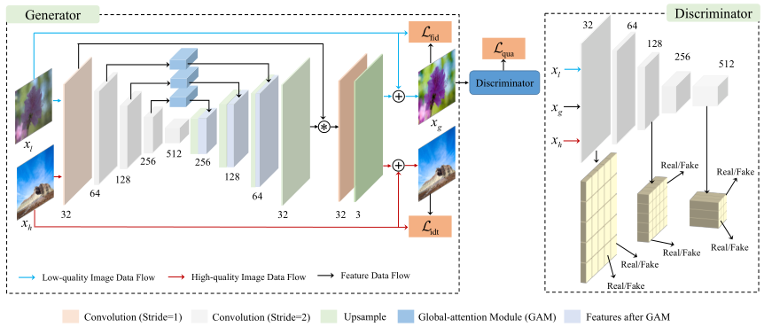

# Introdcurion

This website shares the codes of the "Towards Unsupervised Deep Image Enhancement with Generative Adversarial Network", TIP-2020.

**Abstract:**

Improving the aesthetic quality of images is challenging and eager for the public. To address this problem, most existing algorithms are based on supervised learning methods to learn an automatic photo enhancer for paired data, which consists of low-quality photos and corresponding expert-retouched versions. However, the style and characteristics of photos retouched by experts may not meet the needs or preferences of general users. In this paper, we present an unsupervised image enhancement generative adversarial network (UEGAN), which learns the corresponding image-to-image mapping from a set of images with desired characteristics in an unsupervised manner, rather than learning on a large number of paired images. The proposed model is based on single deep GAN which embeds the modulation and attention mechanisms to capture richer global and local features. Based on the proposed model, we introduce two losses to deal with the unsupervised image enhancement: (1) fidelity loss, which is defined as a ℓ2 regularization in the feature domain of a pre-trained VGG network to ensure the content between the enhanced image and the input image is the same, and (2) quality loss that is formulated as a relativistic hinge adversarial loss to endow the input image the desired characteristics. Both quantitative and qualitative results show that the proposed model effectively improves the aesthetic quality of images.

**The framework of UEGAN:**


## Requirements and Installation
We recommended the following dependencies.
*  Python 3.6
*  PyTorch 1.4.0
*  TensorBoard

## Training
The code will be available soon.


## Citation

If UEGAN is useful for your research, please cite our paper:

```
@article{ni2020towards,
  title={Towards Unsupervised Deep Image Enhancement with Generative Adversarial Network},
  author={Zhangkai Ni, Wenhan Yang, Shiqi Wang, Lin Ma, and Sam Kwong},
  booktitle={IEEE},
  year={2020}
}
```

## Contact

Thanks for your attention! If you have any suggestion or question, you can leave a message here or contact us directly:
eezkni@gmail.com


## License

[MIT License](https://opensource.org/licenses/MIT)


